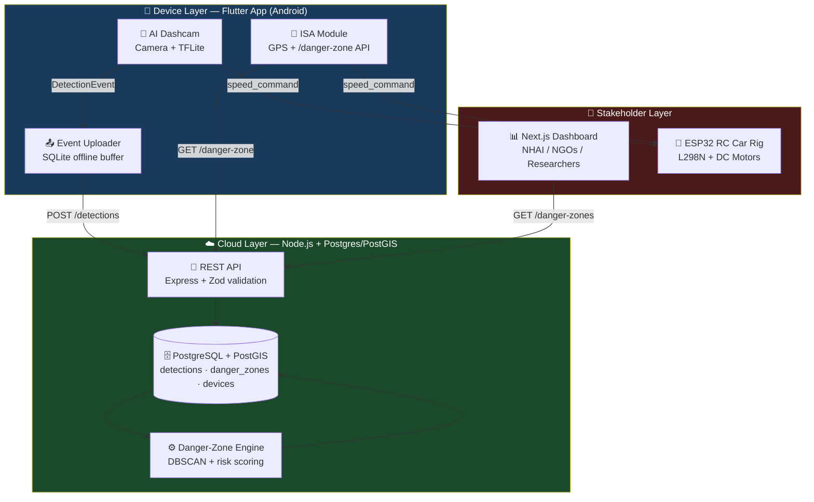
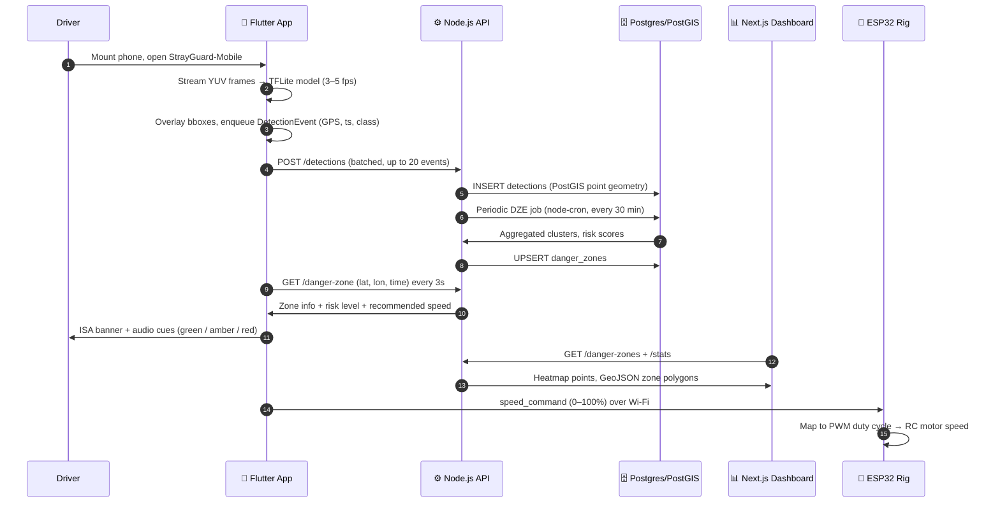
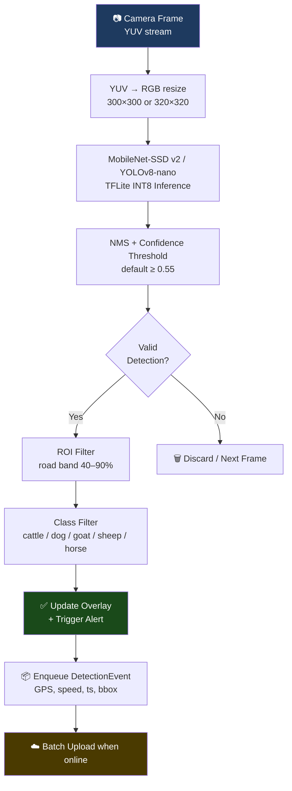
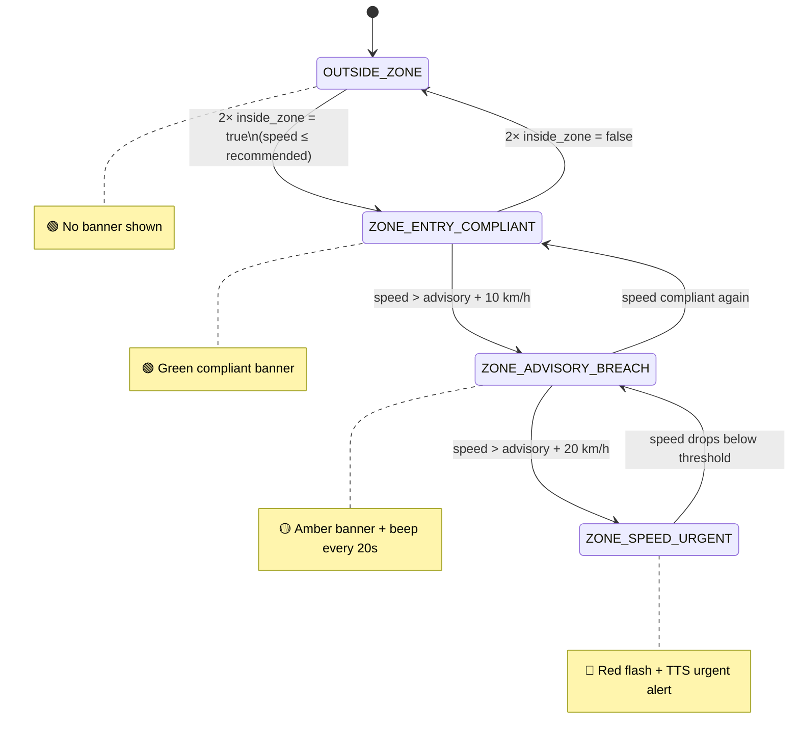
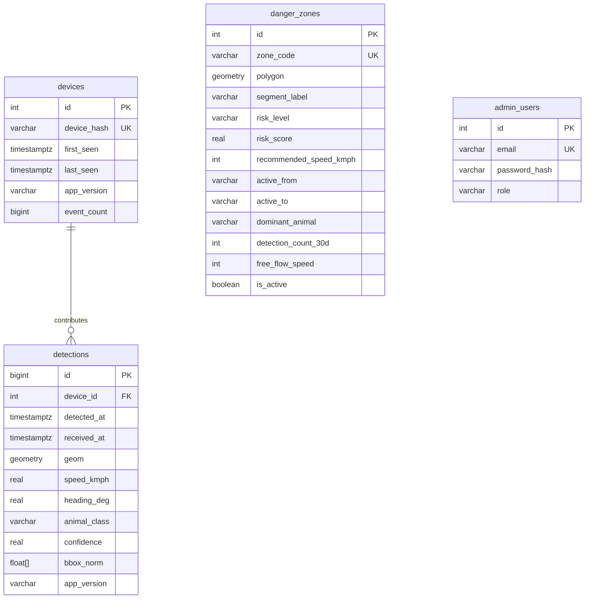
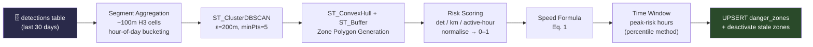
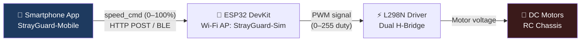

<p align="center">
  
</p>

<h1 align="center">StrayGuard‑Mobile</h1>

<p align="center">
  <b>Smartphone AI Dashcam & Intelligent Speed Assistance for Stray‑Animal Road Safety in India</b>
</p>

<p align="center">
  <a href="https://github.com/JayeshJadhav28/StrayGuard"></a>
  <a href="https://tinyurl.com/n7ryzf39"></a>
  <a href="https://strayguarddashboard.vercel.app"></a>
  
  
  
  
  
</p>

<p align="center">
  <i>Submitted to the National Road Safety Hackathon 2026 — Team StrayGuard Lab, Dnyanshree Institute of Engineering and Technology</i>
</p>

---

## 📋 Table of Contents

- [Overview](#-overview)
- [The Problem](#-the-problem)
- [Key Features](#-key-features)
- [Tech Stack](#️-tech-stack)
- [System Architecture](#-system-architecture)
- [End-to-End Data Flow](#-end-to-end-data-flow)
- [Mobile App (Flutter)](#-mobile-app-flutter)
- [Backend & Database](#️-backend--database)
- [Danger-Zone Engine (DZE)](#-danger-zone-engine-dze)
- [Web Dashboard (Next.js)](#-web-dashboard-nextjs)
- [Hardware Simulation (ESP32)](#-hardware-simulation-esp32)
- [AI Model](#-ai-model)
- [REST API Reference](#-rest-api-reference)
- [Monorepo Structure](#-monorepo-structure)
- [Getting Started](#-getting-started)
- [Testing Strategy](#-testing-strategy)
- [Deployment](#-deployment)
- [Roadmap](#️-roadmap)
- [Contributors](#-contributors)
- [License](#-license)

---

## 🔍 Overview

**StrayGuard‑Mobile** is a smartphone-based AI dashcam and **Intelligent Speed Assistance (ISA)** system that detects stray animals on Indian roads in real time, crowd-sources GPS-tagged detection events to a cloud backend, and advises drivers to reduce speed when entering data-driven danger zones.

A lightweight **ESP32 motor rig** acts as a hardware simulation to demonstrate the future concept of automatic vehicle speed reduction via OBD-II/CAN — without requiring real vehicle integration in the prototype.

```
┌───────────────┐     ┌───────────────────┐     ┌─────────────────────┐     ┌───────────────┐
│  Flutter App  │────▶│ Node.js + PostGIS │────▶│  Next.js Dashboard  │     │  ESP32 RC Rig │
│  AI Dashcam   │     │   Cloud Backend   │     │   Authority View     │     │ Hardware Sim  │
│     + ISA     │◀────│                   │     │                      │     │               │
└───────────────┘     └───────────────────┘     └─────────────────────┘     └───────────────┘
```

---

## 🚨 The Problem

Free-roaming cattle, dogs, goats and other animals are a **persistent hazard on Indian highways**, contributing significantly to crashes — especially at night and during dawn/dusk when visibility is low.

| Existing Countermeasure | Why It Fails |
|---|---|
| Static warning signs | Drivers habituate and ignore them |
| Random speed breakers | Impractical on 60–80 km/h corridors; slow all traffic |
| Fencing | Prohibitively expensive at scale; no dynamic alerting |
| NHAI SMS pilots | One alert per stretch entry; no per-detection event intelligence |

> **There is no low-cost, scalable, driver-owned system that detects animals from the vehicle's perspective, accumulates collective risk intelligence, and advises the correct safe speed in real time.**

### The Physics Argument

> `KE = ½mv²` — a **20% reduction in collision speed reduces kinetic energy by 36%**. A 30% reduction cuts it by **51%**. ISA compliance in danger zones directly reduces crash severity even when a collision still occurs.

---

## ✨ Key Features

### 🐄 On-Device AI Animal Detection
- Lightweight **INT8 TFLite model** running at ~3–5 fps on the phone
- Detects **cattle, buffalo, dogs, goats, sheep and horses** using the rear camera
- ROI filtering discards sky-band and far-lane false positives
- Privacy by design — no raw frames ever leave the device

### 🗺️ Crowd-Sourced Risk Heatmaps
- Each valid detection is converted into an **anonymised GPS-tagged event** and uploaded to the backend
- Backend aggregates events into spatial/temporal hotspots via the **Danger-Zone Engine (DZE)**
- Any smartphone user passively contributes to a **self-improving risk map**

### 🚦 Intelligent Speed Assistance (ISA)
- App polls `/danger-zone` every ~3 s with current GPS position
- **Colour-coded ISA banners** (green / amber / red) and audio alerts based on risk level
- 4-state hysteresis machine prevents banner flicker at zone boundaries

### 📊 Authority-Facing Web Dashboard
- **Next.js 14** dashboard for NHAI / city bodies / NGOs
- Live detection heatmaps with time slider, danger-zone polygons, KPI cards
- Time-series and day-of-week analytics, CSV export, admin DZE control panel

### 🔧 Hardware Simulation (ESP32 RC Car)
- ESP32 + L298N + DC motors physically demonstrate auto-slowdown
- App sends `speed_command` (0–100%) over Wi-Fi when an animal is detected or a danger zone is entered
- Faithfully simulates the OBD-II / CAN control loop for hackathon demo purposes

---

## 🛠️ Tech Stack

| Layer | Technology | Purpose |
|---|---|---|
| **Mobile App** | Flutter (Android) · Riverpod · TFLite | AI dashcam, ISA overlay, event uploader |
| **Backend API** | Node.js 20 LTS · Express 4 · TypeScript | Event ingestion, DZE scheduling, REST API |
| **ORM** | Prisma 5 | Schema management & migrations |
| **Database** | PostgreSQL 16 · PostGIS 3.4 | Spatial queries, zone clustering, heatmaps |
| **Dashboard** | Next.js 14 · React · Leaflet · Recharts | Heatmap, zone map, analytics for authorities |
| **Hardware Sim** | ESP32 DevKit · L298N · DC motors · PlatformIO | RC car speed simulation over Wi-Fi/BLE |
| **ML Pipeline** | Python · PyTorch / TensorFlow → TFLite INT8 | Animal detection model training & export |
| **Monorepo** | Turborepo | Shared types, parallel builds, consistent tooling |
| **CI/CD** | GitHub Actions | Backend tests, dashboard build, Flutter tests |
| **Deployment** | Render.com (API) · Vercel (Dashboard) | Hackathon prototype hosting |

---

## 🧱 System Architecture

### Layered Architecture



### Rulebook Compliance

| Requirement | Implementation | Status |
|---|---|---|
| AI/ML-based solution | On-device TFLite detection + cloud DZE clustering | ✅ Compliant |
| Road safety focus | Stray-animal–vehicle collision prevention | ✅ Compliant |
| Software prototype | Flutter + Node.js + Next.js; zero roadside infra | ✅ Compliant |
| Road-Watch track | Real-time detection, heatmap, danger-zone dashboard | ✅ Compliant |
| Road-SoS track | ISA reduces approach speed, lowers crash energy | ✅ Compliant |
| Scalability | Any smartphone contributes; self-improving risk map | ✅ Compliant |
| Vehicle auto-slowdown | Demonstrated on ESP32 rig; OBD-II = future scope | 🔶 Simulated |

---

## 🔁 End-to-End Data Flow



### Detection & Advisory Pipeline

```
[Phone Camera]
     │ YUV frames
     ▼
[TFLite Inference] ──── INT8 MobileNet-SSD / YOLOv8-nano
     │ boxes, classes, scores
     ▼
[NMS + Confidence Filter] ──── threshold ≥ 0.55, IoU 0.5
     │
     ▼
[ROI Filter] ──── road band y: 40%–90% of frame
     │
     ▼
[Class Filter] ──── cattle / buffalo / dog / goat / sheep / horse
     │
     ├──► [Detection Overlay + Alert]
     │
     └──► [sqflite buffer] ──► [batch POST /detections] ──► [PostgreSQL]
                                                                  │
                                          [DZE cron job] ◄────────┘
                                                │
                                          [danger_zones]
                                                │
                               [GET /danger-zone] ◄── app polls every 3s
                                                │
                                    [ISA advisory to driver]
                                                │
                               [Next.js Dashboard] ◄── GET /danger-zones
```

---

## 📱 Mobile App (Flutter)

### Key Dependencies

| Package | Version | Purpose |
|---|---|---|
| `camera` | ^0.10 | Rear camera preview & frame capture |
| `tflite_flutter` | ^0.10 | On-device TFLite inference |
| `tflite_flutter_helper` | ^0.3 | Input/output tensor utilities |
| `geolocator` | ^11 | GPS lat/lon + vehicle speed |
| `sqflite` | ^2.3 | Offline event buffer (SQLite) |
| `dio` | ^5.4 | Async HTTP client with retry & back-off |
| `flutter_riverpod` | ^2.5 | Reactive state management |
| `flutter_blue_plus` | ^1.3 | Optional BLE link to ESP32 |
| `flutter_tts` | ^4.0 | Text-to-speech zone alerts |
| `maplibre_gl` | ^0.19 | Offline-capable zone map |

### Dashcam Inference Pipeline



### ISA State Machine



### Feature Modules

| Module | Key File | Responsibility |
|---|---|---|
| `dashcam/` | `inference_service.dart` | TFLite lifecycle, frame sampling, NMS post-processing |
| `dashcam/` | `roi_filter.dart` | Road-band region-of-interest filtering |
| `events/` | `event_queue_service.dart` | sqflite queue; max 500 rows FIFO |
| `events/` | `upload_service.dart` | Background isolate; batch POST; exponential back-off |
| `isa/` | `isa_service.dart` | Zone poll every 3s; hysteresis state machine |
| `isa/` | `zone_map_screen.dart` | MapLibre GL danger-zone polygons; tap for detail |
| `hardware_sim/` | `esp32_service.dart` | HTTP / BLE speed commands to ESP32 |
| `settings/` | — | Confidence slider, BLE pairing, privacy controls |

---

## 🖥️ Backend & Database

### Stack

```
Runtime:   Node.js 20 LTS
Framework: Express 4 + TypeScript
ORM:       Prisma 5  (raw PostGIS via $queryRaw)
Database:  PostgreSQL 16 + PostGIS 3.4
Auth:      x-api-key (device uploads) + JWT (dashboard)
Jobs:      node-cron (DZE scheduler)
Logging:   winston + daily rotate file
Validation: zod schemas on all request bodies
```

### Database Schema



### Directory Structure

```
apps/backend/src/
├── index.ts                # App bootstrap
├── app.ts                  # Express factory, middleware, router mount
├── config/
│   ├── env.ts              # Zod-validated env vars
│   └── database.ts         # Prisma client singleton
├── api/
│   ├── detections/         # POST /detections controller + schema
│   ├── zones/              # GET /danger-zone + /danger-zones
│   ├── stats/              # KPI cards + heatmap + time-series
│   └── health/             # /health ping
├── services/
│   ├── dze/                # DZE orchestration, clustering, scoring
│   ├── alerts/             # Optional FCM push dispatch
│   └── cache/              # In-memory zone cache with TTL
├── jobs/
│   └── dze.job.ts          # node-cron: daily 02:00 UTC + surge trigger
└── middleware/
    ├── auth.middleware.ts
    ├── error.middleware.ts
    └── rate-limit.middleware.ts
```

---

## ⚙️ Danger-Zone Engine (DZE)

The DZE runs as a scheduled cron job (every 30 min) and converts raw detection points into risk-scored, geofenced danger zones.

### Processing Pipeline



### Risk Scoring Formula

```
recommended_speed = max(v_min, floor(v_free_flow × (1.0 − α × r)))

Where:
  r           = normalised risk score ∈ [0, 1]
  α           = 0.4  (risk attenuation factor)
  v_min       = 20 km/h (hard floor)
  v_free_flow = segment baseline speed (default 60 km/h)
```

### Risk Level Thresholds

| Risk Level | Score Range | Speed Reduction | ISA Banner Color |
|---|---|---|---|
| 🟢 Low | 0.00 – 0.25 | ≤ 8% | Green |
| 🟡 Medium | 0.25 – 0.55 | 10 – 22% | Amber |
| 🟠 High | 0.55 – 0.80 | 22 – 32% | Orange |
| 🔴 Critical | 0.80 – 1.00 | 32 – 40% | Red |

### Speed Advisory Examples

| Free-Flow | risk=0.0 | risk=0.3 | risk=0.5 | risk=0.8 | risk=1.0 |
|---|---|---|---|---|---|
| **60 km/h** | 60 | 53 | 48 | 41 | 36 |
| **80 km/h** | 80 | 70 | 64 | 54 | 48 |

### DZE Trigger Conditions

| Trigger | Condition | Scope |
|---|---|---|
| Scheduled | Daily at 02:00 UTC | Full recalculation |
| Surge | >15 detections in single 100m cell within 1 hour | Partial: that cell only |
| Manual | Admin dashboard "Recalculate" button | Full or segment |

---

## 📊 Web Dashboard (Next.js)

### Stack

```
Framework:     Next.js 14 (App Router) + TypeScript
Styling:       Tailwind CSS 3 + shadcn/ui
Map:           react-leaflet + leaflet.heat (heatmap) + GeoJSON polygons
Charts:        Recharts (AreaChart, BarChart, PieChart, HeatGrid)
Data fetching: SWR (auto-revalidate every 30s)
Auth:          NextAuth.js — credentials provider (email + password)
```

### Dashboard Panels

| Panel | Description | Audience |
|---|---|---|
| 🗺️ Heatmap | Live detection density with time slider to replay historical patterns | NHAI / Researcher |
| 📍 Zone Map | Danger-zone polygons coloured by risk level; click for speed advisory | Authority / NGO |
| 📈 KPI Cards | Total detections, active zones, top hotspot — auto-refresh 30s | All |
| ⏱️ Time Charts | Hourly and day-of-week detection trends | Researcher |
| 📥 CSV Export | Date-range + road-segment filtered data export | Authority / NGO |
| ⚙️ DZE Control | Manual DZE trigger, last run timestamp, per-zone speed override | Admin |

---

## 🔧 Hardware Simulation (ESP32)

> **Label on demo table:** `Hardware Simulation — Future OBD-II/CAN Integration`

### Bill of Materials (~₹980 total)

| # | Component | Qty | Role | Cost (INR) |
|---|---|---|---|---|
| 1 | ESP32 DevKit V1 (30-pin) | 1 | Wi-Fi/BLE controller | 350 |
| 2 | L298N Dual H-Bridge | 1 | Motor PWM driver | 120 |
| 3 | DC Gear Motors TT | 2 | Drive wheels | 80 |
| 4 | RC Chassis (2WD) | 1 | Physical platform | 200 |
| 5 | 18650 Li-ion cells (2S) | 2 | Power supply | 150 |
| 6 | TP4056 BMS module | 1 | Battery management | 80 |

### Control Chain



### Speed Command Mapping

| Event | Speed Command | RC Car Behaviour |
|---|---|---|
| Normal drive | 80% | Full cruising speed |
| Animal detected ahead | 30% | Visible slowdown |
| Zone entry (high risk) | 50% | Moderate slowdown |
| Hazard cleared / zone exit | 80% | Resume normal speed |

### Flutter → ESP32 Communication

```dart
// features/hardware_sim/esp32_service.dart
Future<void> sendSpeedCommand(int speedPct) async {
  try {
    final response = await dio.post(
      'http://192.168.4.1/speed',        // ESP32 AP IP
      queryParameters: {'speed': speedPct},
    );
    if (response.statusCode == 200) {
      logger.i('ESP32 speed set to $speedPct%');
    }
  } catch (e) {
    logger.w('ESP32 not reachable: $e');
  }
}

// Animal detected   → sendSpeedCommand(30)
// Zone entry        → sendSpeedCommand(50)
// Zone exit/clear   → sendSpeedCommand(80)
```

---

## 🤖 AI Model

### Model Specifications

| Property | MobileNet-SSD v2 | YOLOv8-nano |
|---|---|---|
| Input size | 300 × 300 | 320 × 320 |
| Quantisation | INT8 | INT8 |
| Model size | ~6 MB | ~4.5 MB |
| Inference (mid-range Android) | 180 – 220 ms | 120 – 160 ms |
| mAP@0.5 (target) | ≈ 0.70 | ≈ 0.74 |

### Detection Classes

| ID | Class | Alert Triggered |
|---|---|---|
| 0 | cattle (cow + buffalo) | ✅ Yes |
| 1 | dog | ✅ Yes |
| 2 | goat | ✅ Yes |
| 3 | sheep | ✅ Yes |
| 4 | horse | ✅ Yes |
| 5 | human | ❌ No (logged only — privacy by design) |

### Training Pipeline

```
1. Gather ≥8,000 Indian roadside animal images
   (dashcam clips, web scraping, NGO datasets)

2. Augmentations — Albumentations:
   horizontal flip · brightness jitter · motion blur
   rain overlay · night simulation (gamma 0.3)

3. Label in YOLO format — train/val/test: 70/15/15

4. Train:
   MobileNet-SSD → TF Object Detection API (T4 GPU)
   YOLOv8-nano   → Ultralytics (Google Colab GPU)

5. Export: TFLite INT8 quantisation
   Benchmark on Snapdragon 680 and above

6. Validate mAP, precision, recall, FPR
   on held-out night-time subset
```

### Performance Targets

| Metric | Target |
|---|---|
| mAP@0.5 (all classes) | > 0.72 |
| Per-class recall (cattle) | > 0.75 |
| Per-class recall (dog) | > 0.70 |
| False positive rate | < 12% (200 road-only negatives) |
| Inference latency — mid-range Android | < 250 ms median |
| Inference latency — budget Android | < 500 ms 95th percentile |

---

## 🌐 REST API Reference

Base URL (production): `https://strayguard-api.onrender.com`  
Base URL (development): `http://localhost:3000`

| Method | Endpoint | Auth | Description |
|---|---|---|---|
| `POST` | `/api/v1/detections` | `x-api-key` | Upload batch detection events from app |
| `GET` | `/api/v1/danger-zone` | `x-api-key` | Query if GPS point is inside an active zone |
| `GET` | `/api/v1/danger-zones` | `x-api-key` / JWT | List all active zones with GeoJSON polygons |
| `GET` | `/api/v1/stats/summary` | JWT | KPI cards, by-class, hourly and day-of-week |
| `GET` | `/api/v1/stats/heatmap` | JWT | Detection points for Leaflet heatmap |
| `POST` | `/api/v1/dze/trigger` | Admin JWT | Manually trigger DZE recalculation |
| `POST` | `/api/v1/auth/login` | — | Dashboard login → JWT |
| `GET` | `/health` | — | Server health ping |

### Example: Zone Query Response

```json
{
  "inside_zone": true,
  "zone_id": 12,
  "zone_code": "DZ-NH48-007",
  "risk_level": "high",
  "risk_score": 0.74,
  "recommended_speed_kmph": 43,
  "active_now": true,
  "dominant_animal": "cattle",
  "message": "Animal-risk zone — reduce to 43 km/h"
}
```

---

## 📁 Monorepo Structure

```
strayguard-mobile/
├── turbo.json                     # Turborepo pipeline config
├── package.json                   # Root workspace definition
├── .env.example                   # Template for env vars
│
├── packages/
│   └── shared-types/              # Shared TypeScript types
│       └── src/
│           ├── detection.ts       # DetectionEvent, DetectionResult
│           ├── zone.ts            # DangerZone, RiskLevel, ZoneResponse
│           ├── stats.ts           # StatsSummary, HeatmapPoint
│           └── hardware.ts        # Esp32SpeedCommand
│
└── apps/
    ├── mobile/                    # 📱 Flutter app (AI dashcam + ISA)
    │   ├── lib/
    │   │   ├── features/
    │   │   │   ├── dashcam/       # Camera + TFLite inference
    │   │   │   ├── isa/           # Zone polling + ISA state machine
    │   │   │   ├── events/        # SQLite queue + upload service
    │   │   │   ├── hardware_sim/  # ESP32 BLE/Wi-Fi control
    │   │   │   ├── history/       # Past detections list
    │   │   │   └── settings/      # Threshold, privacy, model info
    │   │   └── core/              # Network client, constants, utils
    │   └── assets/
    │       └── strayguard_v1.tflite  # INT8 TFLite model
    │
    ├── backend/                   # ⚙️ Node.js/Express + PostgreSQL/PostGIS
    │   ├── src/
    │   │   ├── api/               # detections · zones · stats · health
    │   │   ├── services/          # DZE · alerts · cache
    │   │   └── jobs/              # node-cron DZE scheduler
    │   └── prisma/
    │       └── schema.prisma      # Full DB schema
    │
    ├── dashboard/                 # 📊 Next.js 14 dashboard
    │   └── app/
    │       ├── (dashboard)/       # Heatmap · zones · analytics · admin
    │       └── (auth)/login/      # NextAuth login
    │
    └── hardware-sim/              # 🔧 ESP32 PlatformIO project
        └── src/main.cpp           # Wi-Fi AP + HTTP speed endpoint
```

---

## 🚀 Getting Started

### Prerequisites

```bash
node >= 20 LTS
flutter >= 3.19
docker + docker-compose    # for local PostgreSQL/PostGIS
python 3.10+               # ML pipeline only
PlatformIO                 # ESP32 firmware flashing
```

### 1. Clone the Repository

```bash
git clone https://github.com/JayeshJadhav28/StrayGuard.git
cd StrayGuard
```

### 2. Install Node Dependencies

```bash
npm install    # installs backend + dashboard via Turborepo workspaces
```

### 3. Start Local Database (Docker)

```bash
docker-compose up -d db
# PostgreSQL 16 + PostGIS 3.4 on localhost:5432
```

### 4. Configure & Run Backend

```bash
cd apps/backend
cp .env.example .env
# Edit .env — set DATABASE_URL, API_KEY_DEVICE, JWT_SECRET
npx prisma migrate dev
npm run dev
# → http://localhost:3000
```

### 5. Run Next.js Dashboard

```bash
cd apps/dashboard
cp .env.example .env    # set NEXT_PUBLIC_API_URL=http://localhost:3000
npm run dev
# → http://localhost:4000
```

### 6. Run Flutter App

```bash
cd apps/mobile
flutter pub get
flutter run    # requires Android device or emulator
```

> Grant **Camera**, **Location** and **Internet** permissions when prompted.

### 7. Flash ESP32 Firmware (Optional)

```bash
cd apps/hardware-sim
pio run --target upload
# ESP32 starts as Wi-Fi AP: SSID "StrayGuard-Sim" / pass "demo1234"
# HTTP endpoint: http://192.168.4.1/speed?speed=<0-100>
```

---

## 🧪 Testing Strategy

### Unit Tests

| ID | Component | Scenario | Pass Criterion |
|---|---|---|---|
| UT01 | TFLite model | 100 annotated test images | mAP > 0.72 @ IoU 0.5 |
| UT02 | ROI filter | 50 bboxes: 30 road / 20 sky | 100% correct accept/reject |
| UT03 | Event schema | 50 valid + 20 malformed batches | Valid accepted; malformed → 400 |
| UT04 | DZE risk scoring | 2,000 synthetic points | Within ±0.05 of expected score |
| UT05 | Speed formula | 25 risk_score × free_flow combos | Within ±2 km/h; floor enforced |
| UT06 | ISA hysteresis | GPS jitter crossing boundary 30× | Advisory fires only after 2× inside |
| UT07 | Offline buffer | 500 events, network off → on | All 500 uploaded; zero duplicates |
| UT08 | ESP32 HTTP API | POST /speed values 0, 30, 80, 100 | Correct PWM duty; response 200 |

### Integration Tests

| ID | Scope | Pass Criterion |
|---|---|---|
| IT01 | App → Backend | Events in DB within 15s; lat/lon correct |
| IT02 | DZE → DB | Zone upserted with valid PostGIS polygon |
| IT03 | App → /danger-zone | ISA advisory within 6s of GPS crossing |
| IT04 | DZE update → App | App shows updated recommended_speed within 2 min |
| IT05 | App → ESP32 | Motor duty drops; HTTP confirms new speed |
| IT06 | Backend → Dashboard | Density points visible in heatmap within 30s |

### System / End-to-End Tests

| ID | Scenario | Pass Criterion |
|---|---|---|
| SYS01 | Animal detected — full flow | Bbox overlay + audio alert + event in DB + ESP32 slows |
| SYS02 | No animal — no false alert | Zero false detections over 3-minute empty road |
| SYS03 | Human ignored | Detection logged; no driver alert fired |
| SYS04 | Night detection | Recall > 60% under low-light conditions |
| SYS05 | Offline resilience | All 50 buffered events upload on reconnect; no crash |
| SYS06 | Zone entry + ISA | ISA banner within 6s; speed bar correct colour |
| SYS07 | Speed breach escalation | Amber at +10 km/h; red + TTS at +20 km/h |
| SYS08 | Dashcam + ISA simultaneous | Both bbox overlay AND ISA banner visible together |

### Performance Benchmarks

| Metric | Target |
|---|---|
| TFLite inference (mid-range Android) | < 250 ms median |
| TFLite inference (budget Android) | < 500 ms 95th percentile |
| Detection → in-app alert | < 600 ms |
| Event upload latency (connected) | < 15 s detection → DB record |
| `/danger-zone` API response | < 300 ms at 100 concurrent |
| DZE full run (30-day dataset) | < 120 s |
| ISA zone entry latency | < 6 s from GPS boundary cross |
| Battery drain (dashcam active, 1 hr) | < 25% on mid-range phone |

---

## 🚢 Deployment

### Hackathon Demo Targets

| Component | Platform | URL / Notes |
|---|---|---|
| Backend API | Render.com (free tier) | `https://strayguard-api.onrender.com` |
| Web Dashboard | Vercel (free tier) | `https://strayguard.vercel.app` |
| Database | Render.com Postgres + PostGIS | Managed, PostGIS extension enabled |
| Flutter APK | Sideloaded | `flutter build apk --release` |
| ESP32 | Local Wi-Fi AP | `StrayGuard-Sim` @ `192.168.4.1` |

### CI/CD (GitHub Actions)

```yaml
jobs:
  backend-test:
    services:
      postgres:
        image: postgis/postgis:16-3.4
    steps:
      - run: cd apps/backend && npm ci && npm test

  dashboard-build:
    steps:
      - run: cd apps/dashboard && npm ci && npm run build

  flutter-test:
    steps:
      - uses: subosito/flutter-action@v2
      - run: cd apps/mobile && flutter test
```

### Live Demo Script (5–7 min)

```
1. Open app → show live dashcam preview at normal drive speed
2. Move animal cut-out in front of camera → bbox overlay + alert appears instantly
3. Show dashboard → detection count increments, new point on heatmap
4. Simulate GPS entering pre-seeded danger zone → ISA advisory appears within 3s
5. App sends speed_command to ESP32 → RC car slows from 80% to 40% duty cycle
6. Clear hazard → app returns to OUTSIDE_ZONE; RC car resumes normal speed
7. Show dashboard risk map and zone polygons; discuss future OBD-II roadmap
```

---

## 🛣️ Roadmap

| Phase | Feature | Details |
|---|---|---|
| **P1** | OBD-II / CAN integration | Auto-slowdown on real vehicles via ELM327 adapter |
| **P1** | Android Auto / CarPlay | Larger ISA UI on in-car infotainment screen |
| **P2** | Federated learning | Improve model without sharing raw images |
| **P2** | NHAI SMS / API integration | Push zone data to official highway alert systems |
| **P3** | iOS App Store release | After Stage-1 pilot testing |
| **P3** | ISO 26262 pathway | Safety case documentation for OEM adoption |

### OBD-II / CAN Future Architecture

```
StrayGuard App (phone)
        │ Bluetooth Classic (SPP)
        ▼
ELM327-compatible OBD-II adapter
  (plugged into car's OBD-II port)
        │ CAN bus message (vehicle-specific PID)
        ▼
Vehicle ECU
  → reduces throttle / applies light braking
        ▼
Vehicle decelerates to recommended_speed
```

> The ESP32 demo validates the same logical control loop. Replacing the ESP32 HTTP endpoint with a Bluetooth OBD-II CAN write is the remaining engineering work.

---

## 📹 Demo Video

A full demo video showing the app, dashboard and ESP32 rig in action:

👉 **Google Drive:** [https://tinyurl.com/n7ryzf39](https://tinyurl.com/n7ryzf39)

The video covers: (1) normal drive at 80% motor speed, (2) detection triggering an app alert, (3) ESP32 visible slowdown to 40%, (4) recovery once the hazard clears.

---

## 👥 Contributors

**Team StrayGuard Lab**  
Dnyanshree Institute of Engineering and Technology

Contributions, issues and feature requests are welcome — please use the GitHub **Issues** and **Pull Requests** tabs.

---

## 📄 License

This project is licensed under the **MIT License** — see the [LICENSE](LICENSE) file for details.

---

<p align="center">
  
  <br/>
  <i>StrayGuard-Mobile · National Road Safety Hackathon 2026</i>
  <br/>
  <a href="https://github.com/JayeshJadhav28/StrayGuard">github.com/JayeshJadhav28/StrayGuard</a>
</p>